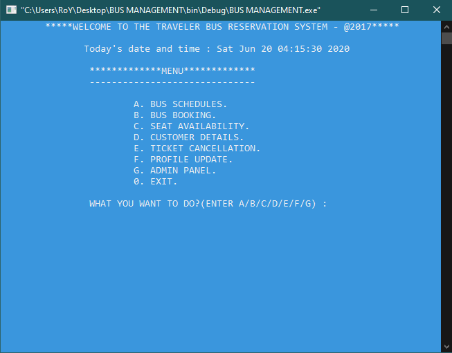

# Bus Management 

### User-Guide: 
Open the "BUS MANAGEMENT.cbp" file in codeblocks. It will open the whole project. Now just run the project.  
The project will create new 4 files based on the day you run it. Those files will be named as follow:
1. [YYYYMDD].C1.Regular Bus Schedule.txt
2. [YYYYMDD].C2.Ticket Owner's Basic Information.txt
3. [YYYYMDD].C3.Booked Seats.txt
4. [YYYYMDD].C4.Availability.txt
** [YYYYMDD].C5.Deleted Profile.txt //if ticket has been cancelled.

### Walkthrough:

* **Home page:**    

* **Bus Schedule:**    

* **Bus Booking:**    

* **Seat Availability: after booking of seat {A1}**    

* **Ticket Cancellation:**    

* **Profile Update:**    

  * After updating email:    
  
  
* **Admin Panel**    
  
  * **List of Passengers**  
      
  * **Cancelled Tickets**  
      
  * **Emergency Bus Deployment**  
      
